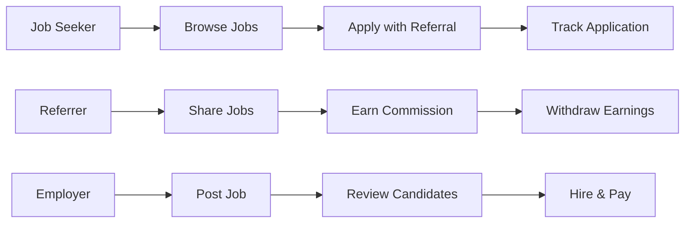

# CTO Architecture Review: MyanJobs Platform

## Executive Summary

Based on FANG-level engineering standards and LinkedIn's product philosophy, this review identifies critical architectural gaps preventing production readiness. The platform currently operates as a collection of disconnected features rather than a cohesive product.

---

## 1. CRITICAL ARCHITECTURAL ISSUES

### 1.1 API Versioning Chaos
**Current State:** Mixed `/api` and `/api/v1` endpoints across 100+ files
**Risk Level:** HIGH
**FANG Standard:** All APIs must be versioned from day one

**Recommendation:**
```
/api/v1/...     # Current stable
/api/v2/...     # Next version (when needed)
/api/internal/... # Internal-only endpoints
```

**Action Items:**
- Create centralized API client (`src/lib/api.ts`)
- Implement API versioning middleware
- Add deprecation headers for old endpoints

### 1.2 No Design System
**Current State:** Inconsistent Tailwind classes, no component library
**Risk Level:** HIGH
**FANG Standard:** Airbnb/Atlassian design system maturity

**Recommendation:**
- Adopt Radix UI primitives + Tailwind
- Create component library with Storybook
- Define design tokens (colors, typography, spacing)

### 1.3 State Management Anti-Patterns
**Current State:** localStorage for auth, no global state
**Risk Level:** MEDIUM
**FANG Standard:** Redux Toolkit / Zustand with persistence

---

## 2. UI/UX TRANSFORMATION ROADMAP

### 2.1 Typography System

**Current:** Default system fonts
**Target:** Professional Myanmar-focused typography

```javascript
// tailwind.config.js
theme: {
  fontFamily: {
    sans: ['Inter', 'Noto Sans Myanmar', 'system-ui', 'sans-serif'],
    display: ['Plus Jakarta Sans', 'Noto Sans Myanmar', 'sans-serif'],
    mono: ['JetBrains Mono', 'monospace'],
  },
}
```

### 2.2 Color Palette (Myanmar Market Optimized)

```javascript
colors: {
  brand: {
    50: '#f0f9ff',
    100: '#e0f2fe',
    500: '#0ea5e9',  // Myanmar flag blue
    600: '#0284c7',
    700: '#0369a1',
  },
  accent: {
    500: '#f59e0b',  // Gold for prosperity
    600: '#d97706',
  },
  success: '#10b981',
  warning: '#f59e0b',
  error: '#ef4444',
}
```

### 2.3 Component Hierarchy

```
src/
├── components/
│   ├── primitives/          # Radix UI wrappers
│   │   ├── Button.tsx
│   │   ├── Input.tsx
│   │   ├── Select.tsx
│   │   └── Dialog.tsx
│   ├── composite/           # Business components
│   │   ├── JobCard.tsx
│   │   ├── ReferralStats.tsx
│   │   └── UserProfile.tsx
│   └── layouts/
│       ├── AppShell.tsx
│       ├── Sidebar.tsx
│       └── Header.tsx
├── hooks/
│   ├── useAuth.ts
│   ├── useApi.ts
│   └── useToast.ts
├── lib/
│   ├── api.ts              # Centralized API client
│   ├── utils.ts
│   └── constants.ts
└── styles/
    ├── globals.css
    └── design-tokens.css
```

---

## 3. TECHNICAL DEBT ELIMINATION

### 3.1 Immediate Fixes (Week 1)

1. **API Client Centralization**
   ```typescript
   // src/lib/api.ts
   import axios from 'axios';
   
   export const api = axios.create({
     baseURL: import.meta.env.VITE_API_URL || '/api/v1',
     headers: { 'Content-Type': 'application/json' },
   });
   
   api.interceptors.request.use((config) => {
     const token = localStorage.getItem('token');
     if (token) config.headers.Authorization = `Bearer ${token}`;
     return config;
   });
   ```

2. **Type Safety**
   - Add strict TypeScript config
   - Generate types from OpenAPI spec
   - Remove all `any` types

3. **Error Handling**
   - Implement global error boundary
   - Add toast notifications
   - Create error logging service

### 3.2 Short-term (Month 1)

1. **Testing Infrastructure**
   - Unit tests: Vitest (target: 80% coverage)
   - E2E tests: Playwright
   - API tests: Postman/Newman

2. **Performance Optimization**
   - Implement React Query for caching
   - Add virtual scrolling for job lists
   - Optimize bundle size (target: <200KB initial)

3. **Accessibility (a11y)**
   - WCAG 2.1 AA compliance
   - Keyboard navigation
   - Screen reader support

### 3.3 Long-term (Quarter 1)

1. **Micro-frontend Architecture**
   ```
   Job Module      →  Referral Module  →  Admin Module
        ↓                    ↓                  ↓
   Shared UI Library + Auth Service + API Gateway
   ```

2. **Real-time Features**
   - WebSocket for notifications
   - Live job updates
   - Chat between referrers and candidates

3. **Mobile-First PWA**
   - Service workers
   - Offline support
   - Push notifications

---

## 4. PRODUCT STRATEGY

### 4.1 Core User Journeys



### 4.2 Key Metrics (North Star)

| Metric | Current | Target (3mo) | Target (12mo) |
|--------|---------|--------------|---------------|
| Job Fill Rate | ? | 40% | 65% |
| Referral Conversion | ? | 15% | 25% |
| Time to Hire | ? | 14 days | 7 days |
| User Retention (D30) | ? | 30% | 50% |

### 4.3 Feature Prioritization

**P0 (Must Have):**
- Job search & application
- Referral tracking
- Basic dashboard
- Payment processing

**P1 (Should Have):**
- Advanced analytics
- Mobile app
- Multi-language (Burmese)
- SMS notifications

**P2 (Nice to Have):**
- AI job matching
- Video interviews
- Blockchain verification
- NFT credentials

---

## 5. ENGINEERING CULTURE

### 5.1 Code Quality Standards

```yaml
# .github/workflows/ci.yml
name: CI
on: [push, pull_request]
jobs:
  quality:
    runs-on: ubuntu-latest
    steps:
      - uses: actions/checkout@v4
      - name: Lint
        run: npm run lint
      - name: Type Check
        run: npm run typecheck
      - name: Test
        run: npm run test:ci
      - name: Build
        run: npm run build
```

### 5.2 Documentation Requirements

- API docs: OpenAPI/Swagger
- Component docs: Storybook
- Architecture: ADRs (Architecture Decision Records)
- Onboarding: README + CONTRIBUTING

### 5.3 Deployment Strategy

```
main branch → Staging → Production
     ↓            ↓          ↓
   Vercel    Render.com   AWS/GCP
```

---

## 6. IMMEDIATE ACTION PLAN

### This Week
1. [ ] Fix all hardcoded API URLs
2. [ ] Implement centralized API client
3. [ ] Add error boundaries
4. [ ] Set up Storybook

### Next 2 Weeks
1. [ ] Create design system foundation
2. [ ] Refactor Dashboard component
3. [ ] Add comprehensive error handling
4. [ ] Implement loading states

### Month 1
1. [ ] 80% test coverage
2. [ ] Performance audit
3. [ ] Accessibility audit
4. [ ] Security audit

---

## 7. RECOMMENDED TECH STACK

| Layer | Current | Recommended |
|-------|---------|-------------|
| Frontend | React + Vite | React + Next.js 14 |
| Styling | Tailwind | Tailwind + Radix |
| State | localStorage | Zustand + React Query |
| Backend | Express | NestJS |
| Database | MongoDB | MongoDB + Redis |
| Auth | JWT | Auth0/Clerk |
| Payments | Custom | Stripe |
| Search | None | Algolia |
| Monitoring | None | Sentry + Datadog |

---

## Conclusion

The platform has solid foundations but requires significant architectural refactoring to meet production standards. Focus on:

1. **Consistency** - One way to do everything
2. **Quality** - Test everything, measure everything
3. **User Experience** - Mobile-first, accessible, fast
4. **Scalability** - Design for 10x growth

The current "page-by-page" approach is creating technical debt. Adopt a component-driven, design-system-first methodology for sustainable growth.
