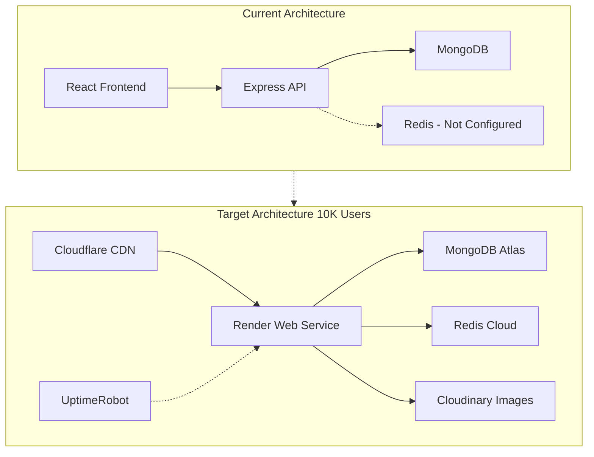
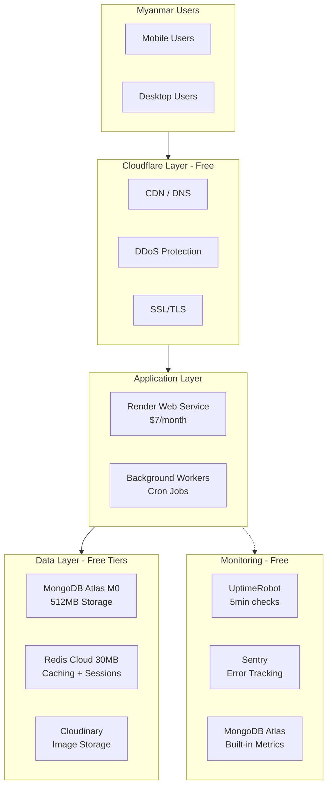
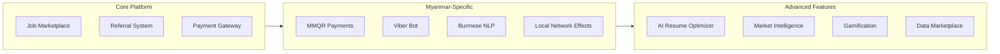
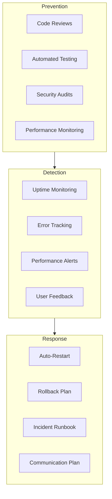
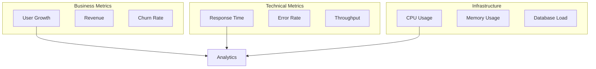
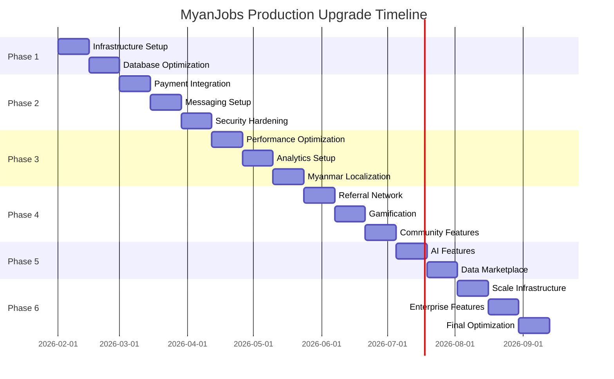

# MyanJobs Platform - Production Upgrade Roadmap

## Executive Summary

This roadmap outlines the production upgrade strategy for the MyanJobs platform to support **10,000 registered members** and **10,000 monthly active users (MAU)** within a **3-6 month timeline** on a **very low budget**. The plan leverages free-tier infrastructure (Render, MongoDB Atlas, Redis Cloud) while ensuring production-ready reliability and Myanmar market differentiation.

**Target Metrics:**
- 10,000 registered members by Month 6
- 10,000 MAU (Monthly Active Users)
- 99.5% uptime
- < 500ms API response time (p95)
- < $100/month infrastructure cost

---

## 1. Current Architecture Assessment

### 1.1 Existing Strengths

| Component | Status | Notes |
|-----------|--------|-------|
| Database Models | ✅ 70+ models | Comprehensive schema coverage |
| API Routes | ✅ 50+ routes | Full REST API implementation |
| Frontend Components | ✅ 50+ components | React + TypeScript + Tailwind |
| Authentication | ✅ JWT + RBAC | Secure multi-role system |
| Payment Infrastructure | ✅ Multi-provider | KBZPay, WavePay, AYA Pay ready |
| Messaging | ✅ Viber/Telegram | Myanmar-optimized channels |
| CI/CD Pipeline | ✅ GitHub Actions | Automated testing & deployment |
| Health Monitoring | ✅ Comprehensive | /health, /metrics endpoints |

### 1.2 Critical Gaps for 10K Users

| Gap | Risk Level | Impact |
|-----|------------|--------|
| No CDN for static assets | HIGH | Slow global load times |
| Redis not configured | HIGH | No caching layer for scale |
| Database indexing incomplete | HIGH | Query performance degradation |
| No auto-scaling | MEDIUM | Traffic spike handling |
| Monitoring stack missing | MEDIUM | Blind to production issues |
| Rate limiting basic | MEDIUM | DDoS vulnerability |
| Backup automation | LOW | Manual recovery risk |

### 1.3 Architecture Gaps Analysis



---

## 2. Low-Cost Infrastructure Architecture

### 2.1 Recommended Tech Stack

| Layer | Current | Recommended | Cost |
|-------|---------|-------------|------|
| **Frontend Hosting** | Render | Cloudflare Pages | FREE |
| **API Hosting** | Render Starter | Render Starter | $7/month |
| **Database** | Local/Railway | MongoDB Atlas M0 | FREE |
| **Cache** | None | Redis Cloud 30MB | FREE |
| **Image CDN** | Local | Cloudinary | FREE (25GB) |
| **Monitoring** | None | UptimeRobot + Sentry | FREE |
| **DNS** | - | Cloudflare | FREE |
| **Email** | SendGrid | SendGrid Free | FREE (100/day) |

### 2.2 Infrastructure Diagram



### 2.3 Render Configuration for Scale

```yaml
# render.yaml - Updated for 10K users
services:
  - type: web
    name: myanjobs-api
    runtime: node
    plan: starter  # $7/month - upgrade to Standard ($25) at 5K users
    buildCommand: npm install && npm run build
    startCommand: npm start
    healthCheckPath: /api/health
    envVars:
      - key: NODE_ENV
        value: production
      - key: MONGODB_URI
        sync: false
      - key: REDIS_URL
        sync: false
      - key: JWT_SECRET
        generateValue: true
    autoDeploy: true
    
  - type: cron
    name: myanjobs-daily-jobs
    runtime: node
    plan: starter
    buildCommand: npm install
    startCommand: npm run cron:daily
    schedule: 0 2 * * *  # 2 AM daily
```

---

## 3. Detailed Cost Breakdown

### 3.1 Monthly Infrastructure Costs

| Service | Tier | Monthly Cost | Limits |
|---------|------|--------------|--------|
| **Render Web Service** | Starter | $7.00 | 512MB RAM, 1 CPU |
| **MongoDB Atlas** | M0 (Free) | $0.00 | 512MB storage, shared RAM |
| **Redis Cloud** | 30MB (Free) | $0.00 | 30MB, 30 connections |
| **Cloudflare** | Free | $0.00 | Unlimited CDN, DNS |
| **Cloudinary** | Free | $0.00 | 25GB storage, 25GB bandwidth |
| **UptimeRobot** | Free | $0.00 | 50 monitors, 5-min intervals |
| **Sentry** | Developer | $0.00 | 5K errors/month |
| **SendGrid** | Free | $0.00 | 100 emails/day |
| **GitHub Actions** | Free | $0.00 | 2,000 minutes/month |
| **TOTAL** | | **$7.00/month** | |

### 3.2 Upgrade Triggers

| User Milestone | Current Tier | Upgrade To | New Monthly Cost |
|----------------|--------------|------------|------------------|
| 1,000 MAU | Render Starter | Keep | $7 |
| 5,000 MAU | Render Starter | Render Standard | $25 |
| 5,000 MAU | MongoDB M0 | MongoDB M10 | $60 |
| 10,000 MAU | Redis 30MB | Redis 250MB | $0 (still free) |
| 10,000 MAU | Cloudinary Free | Cloudinary Plus | $25 |
| **At 10K Users** | | **Total** | **~$110/month** |

### 3.3 One-Time Setup Costs

| Item | Cost | Notes |
|------|------|-------|
| Domain (myanjobs.com.mm) | $20-50/year | Myanmar domain preferred |
| SSL Certificate | $0 | Cloudflare free SSL |
| SendGrid verification | $0 | Free tier activation |
| KBZPay merchant setup | $0 | Free registration |
| WavePay merchant setup | $0 | Free registration |
| **TOTAL ONE-TIME** | **~$50** | |

### 3.4 Optional Paid Services (When Revenue Allows)

| Service | Cost | Benefit |
|---------|------|---------|
| Render Standard | $25/month | Better performance, more RAM |
| MongoDB M10 | $60/month | Dedicated resources, backups |
| Sentry Team | $26/month | More error tracking |
| LogRocket | $99/month | Session replay |

---

## 4. Phase-by-Phase Implementation Plan

### Phase 1: Foundation (Month 1) - **CRITICAL**

**Goal:** Production-ready infrastructure for 1,000 users

#### Week 1-2: Infrastructure Setup
- [ ] Create MongoDB Atlas M0 cluster
- [ ] Set up Redis Cloud 30MB instance
- [ ] Configure Cloudflare CDN + DNS
- [ ] Set up Cloudinary for image hosting
- [ ] Configure Render production deployment
- [ ] Set up UptimeRobot monitoring
- [ ] Configure Sentry error tracking

#### Week 3-4: Database Optimization
- [ ] Run database migrations
- [ ] Create critical indexes (users, jobs, referrals)
- [ ] Set up MongoDB Atlas backups
- [ ] Configure connection pooling
- [ ] Implement query optimization

**Deliverables:**
- Production environment live
- Database optimized
- Monitoring in place
- Cost: $7/month

---

### Phase 2: Core Features (Month 2) - **CRITICAL**

**Goal:** Fully functional referral platform with payments

#### Week 1-2: Payment Integration
- [ ] Activate KBZPay merchant account
- [ ] Activate WavePay merchant account
- [ ] Implement payment webhooks
- [ ] Test payment flows end-to-end
- [ ] Set up payment reconciliation

#### Week 3-4: Messaging & Notifications
- [ ] Configure Viber bot
- [ ] Configure Telegram bot
- [ ] Set up SendGrid email templates
- [ ] Implement notification preferences
- [ ] Test notification delivery

#### Week 5-6: Security & Performance
- [ ] Implement rate limiting
- [ ] Set up CORS properly
- [ ] Configure security headers
- [ ] Add request validation
- [ ] Implement caching layer

**Deliverables:**
- Payments working
- Notifications sending
- Security hardened
- Cost: $7/month

---

### Phase 3: Scale Preparation (Month 3) - **IMPORTANT**

**Goal:** Ready for 5,000 users

#### Week 1-2: Performance Optimization
- [ ] Implement Redis caching for hot data
- [ ] Add database query optimization
- [ ] Set up static asset CDN
- [ ] Optimize image delivery
- [ ] Implement lazy loading

#### Week 3-4: Analytics & Monitoring
- [ ] Set up custom analytics dashboard
- [ ] Implement user behavior tracking
- [ ] Create performance monitoring
- [ ] Set up error alerting
- [ ] Build admin reporting

#### Week 5-6: Myanmar Market Features
- [ ] Optimize for Myanmar mobile networks
- [ ] Implement Burmese language support
- [ ] Add Myanmar-specific job categories
- [ ] Set up local payment methods
- [ ] Optimize for low-bandwidth users

**Deliverables:**
- Performance optimized
- Analytics tracking
- Myanmar-ready
- Cost: $7/month

---

### Phase 4: Growth Features (Month 4) - **IMPORTANT**

**Goal:** Viral growth mechanisms

#### Week 1-2: Referral Network
- [ ] Activate tiered referral system
- [ ] Implement network visualization
- [ ] Set up commission calculations
- [ ] Create referral leaderboards
- [ ] Build invite sharing flows

#### Week 3-4: Gamification
- [ ] Launch achievement system
- [ ] Implement badges
- [ ] Create challenges
- [ ] Set up point system
- [ ] Build progress tracking

#### Week 5-6: Content & Community
- [ ] Launch community forums
- [ ] Create content platform
- [ ] Implement mentorship matching
- [ ] Set up event management
- [ ] Build company profiles

**Deliverables:**
- Viral mechanics active
- Gamification live
- Community growing
- Cost: $7/month

---

### Phase 5: Data & Intelligence (Month 5) - **NICE TO HAVE**

**Goal:** Data-driven platform

#### Week 1-2: Market Intelligence
- [ ] Activate salary benchmarks
- [ ] Implement hiring velocity tracking
- [ ] Create market trend analysis
- [ ] Build skill demand reports
- [ ] Set up automated insights

#### Week 3-4: AI Features
- [ ] Launch resume optimizer
- [ ] Implement job matching
- [ ] Create hire probability scoring
- [ ] Set up automated recommendations
- [ ] Build chatbot assistant

#### Week 5-6: Data Marketplace
- [ ] Launch data products
- [ ] Implement API access
- [ ] Create developer portal
- [ ] Set up API key management
- [ ] Build usage analytics

**Deliverables:**
- AI features active
- Data marketplace live
- API documented
- Cost: $7/month

---

### Phase 6: Scale to 10K (Month 6) - **SCALE**

**Goal:** Handle 10,000 users reliably

#### Week 1-2: Infrastructure Upgrade
- [ ] Upgrade to Render Standard ($25)
- [ ] Upgrade MongoDB to M10 ($60)
- [ ] Scale Redis if needed
- [ ] Optimize database sharding
- [ ] Load test at 10K users

#### Week 3-4: Enterprise Features
- [ ] Launch enterprise plans
- [ ] Implement SSO
- [ ] Create custom integrations
- [ ] Set up dedicated support
- [ ] Build admin controls

#### Week 5-6: Optimization
- [ ] Performance tuning
- [ ] Cost optimization review
- [ ] Security audit
- [ ] Documentation update
- [ ] Team training

**Deliverables:**
- 10K user capacity
- Enterprise ready
- Fully documented
- Cost: ~$110/month

---

## 5. Myanmar Market Differentiators

### 5.1 Unique Value Propositions

| Feature | Myanmar Advantage | Implementation |
|---------|-------------------|----------------|
| **Mobile-First** | 90% mobile usage | Responsive PWA, low bandwidth |
| **Local Payments** | KBZPay, WavePay dominance | Native integration |
| **Messaging** | Viber 99% penetration | Bot integration |
| **Language** | Burmese support | Full i18n implementation |
| **Offline Capability** | Unreliable internet | Service workers, caching |
| **Low Data Mode** | Expensive data | Compressed images, lazy load |

### 5.2 Competitive Moat Features



### 5.3 Myanmar-Specific Optimizations

1. **Network Resilience**
   - Offline-first architecture
   - Request retry with exponential backoff
   - Compressed API responses
   - Image optimization (WebP, lazy loading)

2. **Payment Integration**
   - KBZPay QR payments
   - WavePay wallet integration
   - MMQR standard support
   - Cash pickup options

3. **Communication**
   - Viber bot for notifications
   - Telegram channel broadcasts
   - Burmese language support
   - Voice message support

4. **Trust Building**
   - KYC verification
   - Company verification badges
   - Review system
   - Secure escrow payments

---

## 6. Risk Mitigation Strategies

### 6.1 Technical Risks

| Risk | Probability | Impact | Mitigation |
|------|-------------|--------|------------|
| Database overload | Medium | High | Indexing, caching, connection pooling |
| Payment failures | Medium | High | Multiple providers, retry logic |
| Downtime | Low | High | Health checks, auto-restart, monitoring |
| Data loss | Low | Critical | Daily backups, point-in-time recovery |
| Security breach | Low | Critical | Rate limiting, input validation, audits |

### 6.2 Business Risks

| Risk | Probability | Impact | Mitigation |
|------|-------------|--------|------------|
| Low user adoption | Medium | High | Marketing, referral incentives, partnerships |
| Payment provider issues | Medium | High | Multiple providers, manual fallback |
| Regulatory changes | Low | Medium | Legal compliance, flexible architecture |
| Competition | High | Medium | Unique features, network effects |

### 6.3 Mitigation Actions



---

## 7. Success Metrics & Monitoring

### 7.1 Key Performance Indicators (KPIs)

| Metric | Target | Measurement |
|--------|--------|-------------|
| **User Growth** | 10,000 members | MongoDB user count |
| **Monthly Active Users** | 10,000 MAU | Last 30-day login |
| **Platform Uptime** | 99.5% | UptimeRobot |
| **API Response Time** | < 500ms p95 | Sentry/Custom |
| **Page Load Time** | < 3s | Lighthouse |
| **Error Rate** | < 1% | Sentry |
| **Payment Success** | > 95% | Payment logs |
| **Referral Conversion** | > 20% | Referral tracking |

### 7.2 User Engagement Metrics

| Metric | Target | Tool |
|--------|--------|------|
| Daily Active Users (DAU) | 3,000 | Custom analytics |
| Session Duration | > 5 min | Custom analytics |
| Jobs Posted/Month | 500 | Database |
| Referrals Made/Month | 1,000 | Database |
| Successful Hires/Month | 100 | Database |
| NPS Score | > 50 | Survey |

### 7.3 Technical Metrics Dashboard



### 7.4 Alerting Thresholds

| Metric | Warning | Critical | Action |
|--------|---------|----------|--------|
| API Response Time | > 300ms | > 1000ms | Investigate/Scale |
| Error Rate | > 0.5% | > 2% | Rollback/Fix |
| CPU Usage | > 70% | > 90% | Scale/Optimize |
| Memory Usage | > 80% | > 95% | Restart/Scale |
| Database Connections | > 80% | > 95% | Check pool/Scale |
| Disk Usage | > 80% | > 95% | Cleanup/Upgrade |

---

## 8. Implementation Checklist

### Pre-Launch (Month 1)

- [ ] MongoDB Atlas cluster created
- [ ] Redis Cloud instance active
- [ ] Cloudflare CDN configured
- [ ] Render production deployment
- [ ] Domain DNS configured
- [ ] SSL certificates installed
- [ ] Environment variables set
- [ ] Database migrations run
- [ ] Indexes created
- [ ] Monitoring active
- [ ] Backup schedule configured
- [ ] Payment providers registered
- [ ] Messaging bots configured
- [ ] Email service verified

### Launch (Month 2)

- [ ] Soft launch to beta users
- [ ] Payment flows tested
- [ ] Notifications working
- [ ] Security audit passed
- [ ] Performance benchmarks met
- [ ] Documentation complete
- [ ] Support channels ready
- [ ] Marketing materials ready

### Post-Launch (Month 3-6)

- [ ] Daily monitoring review
- [ ] Weekly performance reports
- [ ] Monthly cost reviews
- [ ] User feedback collection
- [ ] Feature iteration
- [ ] Scale infrastructure as needed
- [ ] Optimize costs
- [ ] Plan next phase

---

## 9. Summary

### 9.1 Timeline Overview



### 9.2 Budget Summary

| Phase | Duration | Monthly Cost | One-Time |
|-------|----------|--------------|----------|
| Phase 1-4 | Months 1-4 | $7 | $50 |
| Phase 5 | Month 5 | $7 | $0 |
| Phase 6 | Month 6 | $110 | $0 |
| **Total** | **6 Months** | **~$150** | **~$50** |

### 9.3 Success Criteria

✅ **By Month 3:**
- 1,000 registered users
- Platform stable (99.5% uptime)
- Payments processing
- < $10/month cost

✅ **By Month 6:**
- 10,000 registered users
- 10,000 MAU
- 99.5% uptime maintained
- < $110/month cost
- Revenue positive

---

## 10. Next Steps

1. **Immediate (This Week):**
   - Set up MongoDB Atlas cluster
   - Create Redis Cloud instance
   - Configure Cloudflare CDN

2. **Week 2:**
   - Deploy to Render production
   - Run database migrations
   - Set up monitoring

3. **Week 3-4:**
   - Integrate payment providers
   - Configure messaging bots
   - Security hardening

4. **Month 2:**
   - Soft launch
   - Gather feedback
   - Iterate quickly

---

**Document Version:** 1.0  
**Last Updated:** February 7, 2026  
**Owner:** Technical Architecture Team  
**Status:** Ready for Implementation
